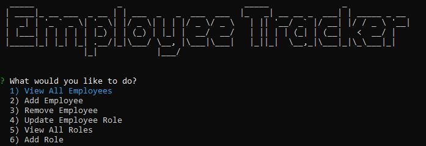

# Employee-Tracker

## Overview: 

I built an employee tracker using SQL, node.js and inquirer that can be run through the terminal. The user is prompted to answer a series of questions that help to view, add, edit, and delete employees, departments, roles, salary, and managers. 

## Technologies used:
  * SQL 
  * JavaScript
  * Node.js
  * Inquirer

Link to video demonstration: 
